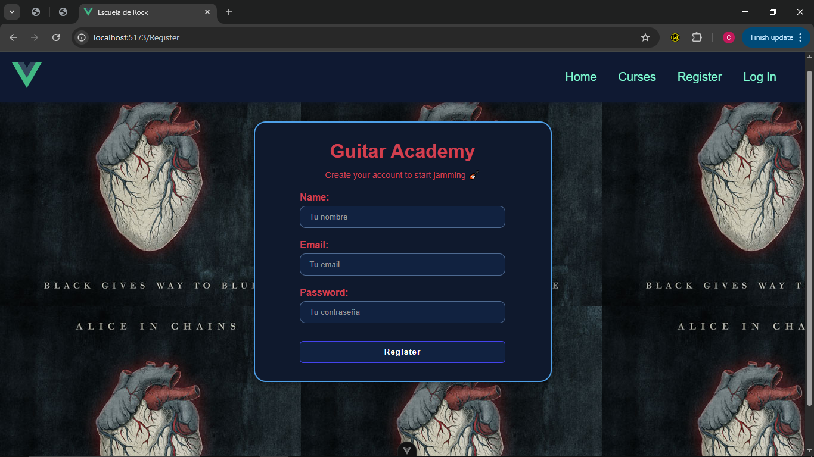
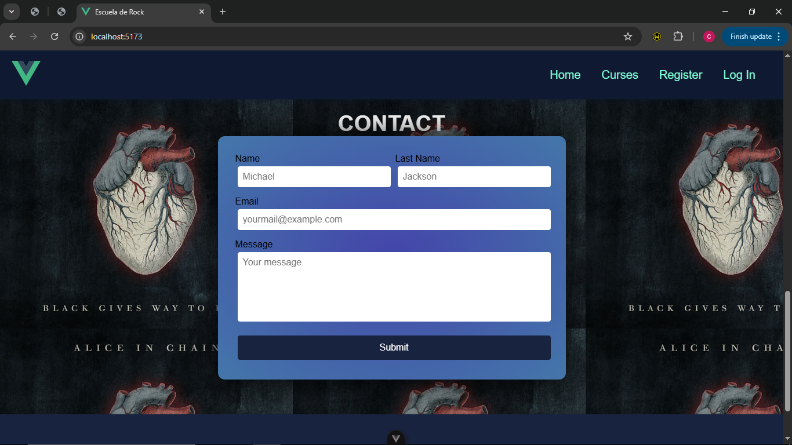
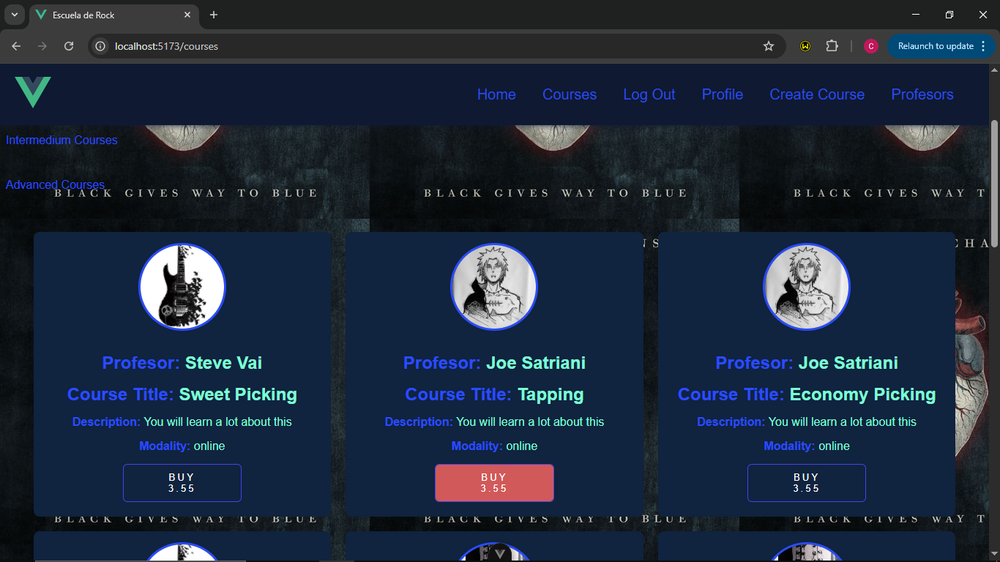
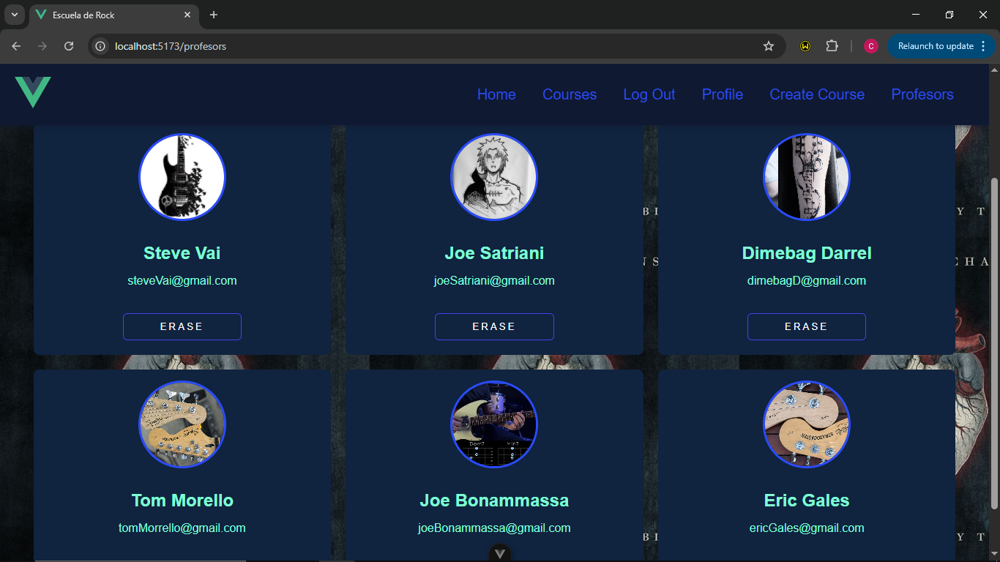

# 🎸 Guitar Academy

Educative web plataform for guitarist all over the world. Selling guitar courses from beginner to advanced levels. Improve your skills as a guitarist buying courses of some of the best master guitarists teachers from all over the world. A page were you can dominate and learn all techniques in the guitar, learning about music, scales, chords and harmony, all in one, but of course.. music theory principally dedicated to the guitar instrument.

---

## 🚀 Tecnologías
- Vue.js
- Node.js
- Express
- PostgreSQL
- REST API
- Git & GitHub

---

🚀 Funcionalidades principales del proyecto
Este proyecto es una plataforma educativa full-stack desarrollada con Vue en el frontend, Node.js + Express en el backend y PostgreSQL como base de datos. A continuación se detallan sus funcionalidades principales.

🔹 Visualización y gestión de profesores
🔹 Vista pública de profesores

Todos los usuarios, estén logueados o no, pueden acceder a la sección Profesores.
Se muestran todos los profesores registrados con su:

-Nombre
-Email
-Imagen de perfil

La información se obtiene mediante peticiones al backend y se renderiza dinámicamente en tarjetas.

🔹 Funcionalidades exclusivas del administrador
Cuando el usuario tiene rol Administrador, el sistema lo reconoce automáticamente y se habilitan botones adicionales en la vista de profesores:

-Insert professor (en desarrollo)
-Erase professor (en desarrollo)

Estos botones solo se muestran si el usuario es administrador.

Aunque estas acciones están aún en desarrollo, el renderizado condicional por rol funciona correctamente y demuestra la lógica de autorización del sistema.

🔹 Sistema de imágenes de perfil (uploads)
El proyecto implementa una lógica clara y escalable para manejar imágenes de perfil:

-Existe una carpeta /uploads en el backend.
-Las imágenes se almacenan físicamente en esa carpeta.
-En la base de datos solo se guarda la ruta de la imagen, no el archivo en sí.
-El backend expone la carpeta /uploads como contenido estático, permitiendo que las imágenes se accedan mediante una URL estable.
-El frontend recibe la ruta de la imagen desde el backend y la renderiza dinámicamente en cada tarjeta.

Actualmente:
-Las imágenes han sido añadidas manualmente a la carpeta uploads.

La lógica está preparada para que en el futuro los usuarios puedan subir su imagen mediante un botón Upload.

🔹 Perfil de usuario (en desarrollo).
Se está desarrollando la vista Profile, accesible para:

1- Profesores
2- Administradores
3- Alumnos

En esta vista se mostrará la información del usuario según su rol.
El objetivo principal de esta sección es permitir:
- Subir o cambiar la foto de perfil
- Gestionar información personal
- El botón Upload ya está planteado conceptualmente y será el encargado de enviar la imagen al backend y almacenarla en /uploads.

🔹 Gestión de cursos
🔹 Visualización de cursos
Los cursos se muestran en tarjetas dinámicas.
Cada curso incluye:
- Información del curso
- Dificultad
- Modalidad
- Precio
- Profesor al que pertenece (nombre e imagen)
Existe un navbar de filtrado que permite ver cursos por dificultad:
1- Beginner
2- Intermediate
3- Advanced

🔹 Create Course (profesores y administradores)
El botón Create Course se muestra únicamente a:

1- Profesores
2- Administradores
El formulario cuenta con validaciones (required) y estructura profesional.

📌 Si el usuario es profesor:
- El curso se crea automáticamente asociado a su usuario.
- No necesita seleccionar profesor.

📌 Si el usuario es administrador:
- Se muestra un select dinámico de profesores.
- El administrador elige a qué profesor asignar el curso.
- El curso queda correctamente vinculado a ese profesor.
- Esta lógica garantiza una relación clara entre cursos y profesores.

🔹 Autenticación, roles y seguridad
- Sistema completo de login con token.
- El token se guarda en Local Storage.
- La sesión se mantiene activa y el frontend identifica el rol del usuario.
- La UI se adapta dinámicamente según permisos.

🔹 Arquitectura y organización del backend
El backend está organizado de forma clara y escalable:

1- authorization.js
Contiene la lógica de autorización y control de roles.

2- queries.js
Centraliza todas las consultas SQL a PostgreSQL.

3- seeds
Scripts para insertar datos iniciales (usuarios, profesores, etc.).

4-index.js
Punto de entrada del servidor donde se combinan rutas, autorización y queries.

---

## 📸 Screenshots

---

## 📌 Estado del proyecto
Todas las funcionalidades descritas están funcionando correctamente, salvo aquellas marcadas explícitamente como en desarrollo.

---

## 👤 Autor
**CharlesPuyalena**  
Informatic engeeniery student of the Jose Antonio Hechevarría University (CUJAE)... CUBA(3er año) 
Mid-Level Full Stack Web Developer  
GitHub: https://github.com/charl3sprogram
